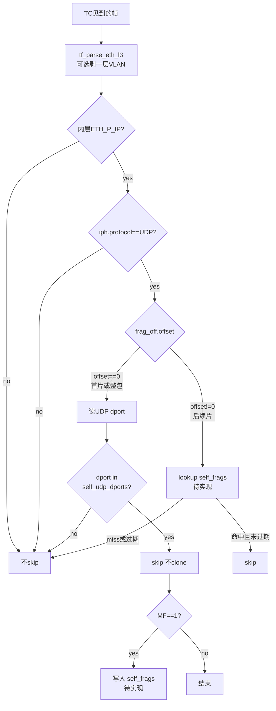

# 自流量防环：VLAN 解析与 IP 分片状态表

> **位置**：workspace 仓 `docs/traffic-forwarding/`（协作真相源）。  
> 关联：[`ovs-bridge-hairpin-mirror-amplification.md`](./ovs-bridge-hairpin-mirror-amplification.md)、  
> [`traffic-forwarding-path-evolution.md`](./traffic-forwarding-path-evolution.md) §6。  
>
> | 能力 | 状态 |
> |------|------|
> | 单层 802.1Q/AD 后再认 IPv4+UDP dport | **已落地**（`tf_parse_eth_l3` + `traffic_forwarding_should_skip_by_udp_dport`） |
> | 自有 VXLAN 分片链 LRU map（非首片连坐 skip） | **设计已定，待实现** |
>
> 当前运行时已能跳过：无 VLAN 或单层 VLAN 后的完整 IPv4+UDP（含分片**首片**），且 dport ∈ 自有 VXLAN 端口表。  
> **非首片**仍可能漏过滤，需靠下文分片 map 收口。

---

## 1. 背景与目标

流量转发在目标网卡 TC 上 `bpf_clone_redirect` 做旁路镜像。自有 VXLAN 从 underlay 发出后，若与业务口同 OVS bridge，可能**回灌**到业务口 ingress，旧逻辑只在 egress 按 UDP dport 防环时，会再次 clone，被 `veth_a` TBF 塑成「≈限速」的周期平台。

目标：

1. 认出「自有 VXLAN / 回灌自流量」→ **不二次 clone**。  
2. **尽量不误伤**本应采集的业务流量。  
3. skip 只停「再镜像」；underlay 正常出站、对端 VTEP 收包不受影响。

挂载点要求：**ingress 与 egress 共用同一套 skip 逻辑**。

---

## 2. 总流程



实现入口（现状函数名）：`traffic_forwarding_should_skip_by_udp_dport()`  
（落地分片 map 时可扩成 `…_should_skip_self_traffic()`，或保持原名向内扩展。）

---

## 3. VLAN 单层解析（已落地）

### 3.1 问题

不是产品在 VXLAN 外再封 VLAN，而是 TC 看到的帧可能是：

```text
[以太][802.1Q 或 802.1AD][IP][UDP][VXLAN]…
```

只认「以太后直接是 IP」时，带 tag 的自有 VXLAN 会漏过滤。

### 3.2 行为

`tf_parse_eth_l3()`：

```text
读 ethertype
  → 若为 0x8100（Q）或 0x88a8（AD）：跳过 4 字节 VLAN 头（只剥一层）
  → 输出内层 ethertype 与 L3 起点
```

- **单层**：QinQ（两层 VLAN）仍可能认不出。  
- 自流量防环与流表五元组解析共用该 helper。

### 3.3 何时会看到 VLAN

| 场景 | TC 常见帧形态 |
|------|----------------|
| 采集口 **access**（OVS `tag=N`） | 主机侧常为裸以太网；进桥后才带 VLAN |
| 采集口 **trunk** / `vlan.N@eth` | 以太 + 802.1Q + IP |
| 同桥回灌打到 **trunk 业务口** | 回灌自有 VXLAN 可能带 tag |
| 物理口 / 交换机本身打 tag | 外层 802.1Q/AD |

access 口上「无 VLAN 也能认」仍然有效；**trunk / VLAN 子接口 / tagged 回灌** 依赖本次剥 tag。

### 3.4 误伤

**低。** 只改变「能不能认出端口」；认出且命中自有 VXLAN 端口才 skip。  
业务 VLAN 内普通 TCP/UDP **不会**仅因剥了 tag 就被跳过。

---

## 4. 整包 / 首片：自有 UDP dport（已落地）

### 4.1 Map

| 项 | 说明 |
|----|------|
| 名称 | `traffic_forwarding_self_udp_dports` |
| 类型 | `HASH` |
| key | UDP dest port（**主机序**） |
| value | `u8` 启用标记 |
| 填充 | **用户态**下发（产品 VXLAN 端口，如 4790） |

### 4.2 判定

在「无 VLAN 或已剥单层 VLAN」之后：

```text
IPv4 + protocol=UDP + 能读到 UDP 头 + dport ∈ self_udp_dports
  → skip（不 clone）
```

覆盖：

- 完整外层 VXLAN（未分片）  
- IP 分片 **第一片**（offset=0，载荷仍以 UDP 头开头）

不覆盖：后续片、QinQ、外层 IPv6（见 §5 / §6）。

---

## 5. 后续片：分片状态 map（设计已定，待实现）

### 5.1 为何会分片

```text
大包 →（可选 GSO）→ 加 VXLAN/UDP/IP
  → 外层仍可能 > underlay MTU
  → IP 分片
```

| 片 | 能否靠 dport skip |
|----|-------------------|
| 第一片（offset=0，含 UDP） | 能（§4） |
| 非第一片（无 UDP 头） | **不能** → 漏过滤 → 可能再 clone |

GSO 理想时每段都是完整「IP+UDP+VXLAN」，通常不必再 IP 分片；一旦落到 IP 分片，只有首片能用现有逻辑。

### 5.2 错误做法（禁止）

| 做法 | 后果 |
|------|------|
| 凡是 IPv4 分片（或所有非首片）一律 skip | **误伤**业务大包分片，镜像缺片，`collected_bytes` 偏少 |
| 凡是 `protocol=UDP` 的非首片一律 skip | 同样误伤业务 UDP 分片 |

### 5.3 推荐做法：只连坐「自有 VXLAN 分片链」

```text
1. 首片：UDP dport ∈ self_udp_dports → skip；
   若 MF=1 → 写入 self_frags，key=(saddr,daddr,protocol,id)
2. 后续片：同 key 命中且未过期 → skip
3. 其它分片：照常采集（允许 clone）
```

| 流量 | 结果 |
|------|------|
| 自有 VXLAN 首片 + 后续片 | 都跳过，防环 |
| 业务 UDP/TCP 分片 | **仍采集**（不进表） |
| 业务完整包 | 不变 |

### 5.4 Map 定稿参数

建议新增：`traffic_forwarding_self_frags`

```c
struct traffic_forwarding_self_frag_key {
	__be32 saddr;
	__be32 daddr;
	__u8   protocol; /* 与 iphdr.protocol 一致，自有 VXLAN 为 UDP */
	__u8   pad[3];
	__be16 id;       /* iphdr.id，网络序原样 */
};

/* value: 最近见到的 bpf_ktime_get_ns()，用于软 TTL */
```

| 项 | 定稿 | 理由 |
|----|------|------|
| 类型 | `BPF_MAP_TYPE_LRU_HASH` | 与 `flow_source` 同型；满则淘汰，免用户态扫表 |
| key | `(saddr, daddr, protocol, id)` | 与分片重组键一致；**不含端口**（后续片无 UDP） |
| value | `__u64` 时间戳 ns | 软 TTL |
| 软 TTL | 查找时 `now - last > 2s` 视为 miss | 压低 IP ID 复用误 skip；分片链通常远短于 2s |
| max_entries | 8192 | 短生命周期；远小于 flow 表 |
| 写入条件 | 仅 **offset==0** 且 dport 命中且 **MF=1** | 整包（MF=0）不必占表 |
| 填充方 | **BPF 自动**；用户态不填 | 与 `self_udp_dports` 职责分离 |
| 刷新 | 命中后续片时可更新时间戳（可选，实现时二选一写清） | 延长仍在传输的链 |

伪代码骨架：

```text
frag_off = ntohs(iph->frag_off)
offset   = frag_off & IP_OFFSET
mf       = frag_off & IP_MF

if offset != 0:
    key = {saddr, daddr, protocol, id}
    v = lookup(self_frags, key)
    if v && now - *v <= 2s: return skip
    return keep

# offset == 0：读 UDP，查 self_udp_dports
if dport not in self_udp_dports: return keep
# skip
if mf:
    update(self_frags, key, now)
return skip
```

### 5.5 残留与边界

| 情况 | 行为 |
|------|------|
| 后续片先于首片到达（乱序） | 首次可能 **漏 skip**；首片写入后同链恢复。可接受 |
| LRU 满 | 淘汰最久未用；极端下偶发漏 skip |
| IP ID 复用 + TTL 内 | 极短窗口误 skip 同四元组其它 UDP 分片；2s TTL 压低概率 |
| QinQ / 外层 IPv6 | 本设计仍不覆盖 |

### 5.6 与「接收端能不能收到」

- skip 的是业务口上「不要再采自有隧道」；**不挡** underlay 正常出站。  
- 精确 key 方案下，业务分片仍进采集管道。

### 5.7 治本（并行，优先降低对 map 的依赖）

隧道 GSO / 控制段长，使外层 ≤ underlay MTU，少产生外层 IP 分片。分片变少后，多数情况只需 §4 的 dport 过滤。

---

## 6. 能力边界一览

| 已覆盖 / 已定稿 | 未覆盖 |
|-----------------|--------|
| 以太 → IPv4 → UDP → dport∈表 | QinQ |
| 以太 → **单层 802.1Q/AD** → IPv4 → UDP → dport∈表 | 外层 IPv6 |
| 完整包 / 分片首片（dport） | — |
| 分片后续片：经 `self_frags` 连坐（**待实现**） | 乱序首包前的偶发漏 skip |

---

## 7. 建议落地顺序

```text
1. VLAN 单层解析                         → 已做
2. ingress + egress 共用 dport skip      → 已做（见 hairpin 文档）
3. 减少外层 IP 分片（GSO/MTU）           → 治本，持续
4. 实现 self_frags LRU + 软 TTL          → 下一步编码
5. 禁止「全局 skip 所有分片」            → 评审红线
```

编码落点（实现时）：

- map / key：`traffic_forwarding_maps.h`、`types.h`  
- 逻辑：`traffic_forwarding_helpers.h`（扩展现有 skip）  
- 调用：`probe.c` ingress / egress（保持同一入口）  
- 约定：局部变量使用处声明或带初始值（见 bpf-kernel-tc-conventions）

---

## 8. 验收要点

**已实现：**

- 带一层 802.1Q 的自有 VXLAN：ingress/egress 均不再二次 clone。  
- 业务 VLAN 内普通流量：采集量与改前一致。  
- 对端 VTEP 仍能稳定收到镜像流。

**分片 map 落地后追加：**

- 制造外层 IP 分片的自有 VXLAN：首片 + 后续片均不被再次 clone。  
- 业务大 UDP 分片：后续片仍会被 clone。  
- 满 LRU / ID 复用极端情况：偶发漏 skip 或极短误 skip，不导致业务采集长期失效。

现场确认回灌仍用 hairpin 文档最小抓包集（underlay out 有、业务口 in 有、业务口 out 无）。

---

## 9. 一句话

> **VLAN：剥一层 tag 再认 VXLAN 端口，几乎不误伤业务（已落地）。**  
> **分片：不能一刀切 skip；首片认 dport 并（MF=1 时）写入 LRU 表，后续片按 `(saddr,daddr,proto,id)` 连坐；优先少分片，再上精确防环（设计已定，待编码）。**
