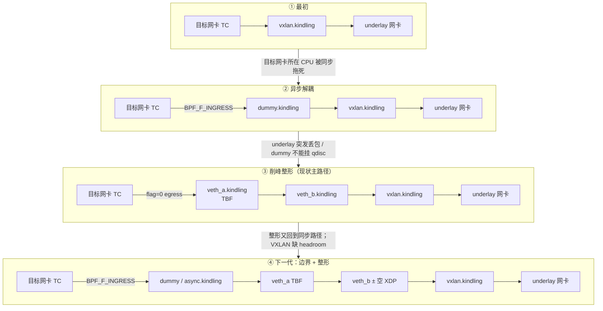
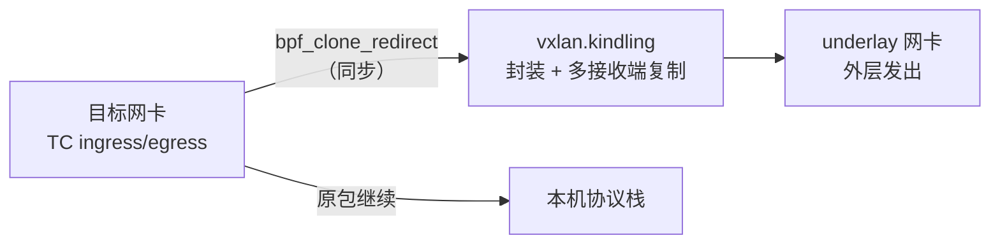
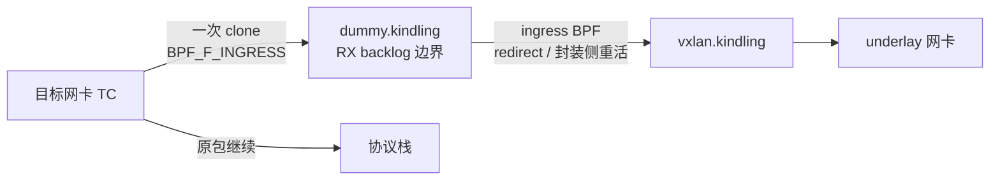
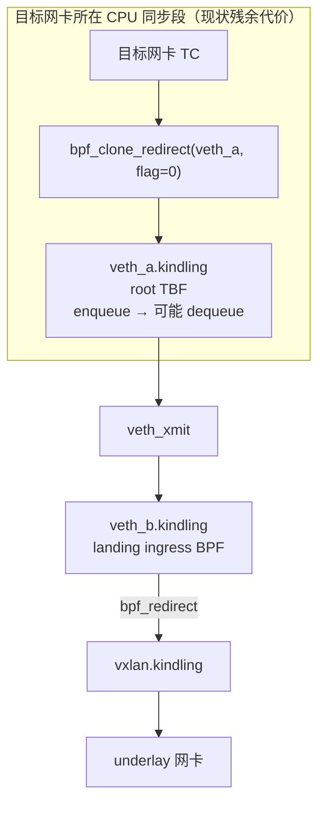
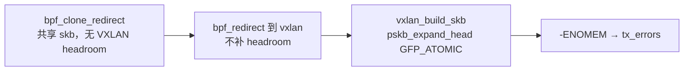
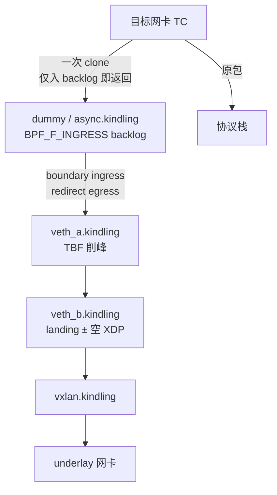
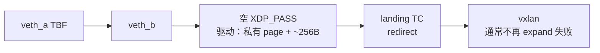

# 流量转发链路演变：拓扑 · 问题 · 方案

> **位置**：workspace 仓 `docs/traffic-forwarding/`（可提交；与 skill `traffic-forwarding` 配套）。  
> 本文按时间线整理流量转发（镜像）链路的几代拓扑：每代解决了什么、又引出什么，以及空 XDP 在演进中的位置。  
> 细节方案见文末关联文档；本文只做演变总览。
>
> **用语约定**
>
> | 本文用语 | 含义 |
> |----------|------|
> | 目标网卡 | 需要采集/镜像的那张网卡（其上挂 TC-BPF） |
> | underlay 网卡 | VXLAN 封装后真正把外层包发出去的底层网卡 |
> | 自有设备 | 产品创建的 `dummy` / `veth` / `vxlan.kindling` 等，与客户业务口解耦 |

---

## 0. 一图总览



| 代际 | 拓扑 | 状态 | 核心诉求 |
|------|------|------|----------|
| ① | 目标网卡 → `vxlan.kindling` | 历史 | 能镜像出去 |
| ② | 目标网卡 → `dummy` → `vxlan` | 已落地验证 | 业务路径尽快返回 |
| ③ | 目标网卡 → `veth_a/b` → `vxlan` | **当前主路径** | 自有设备上削峰，保护 underlay |
| ④ | 目标网卡 → `dummy` → `veth_a/b` → `vxlan` | 设计中 | 异步边界 + 削峰兼得 |
| +XDP | `veth_b` 挂空 `XDP_PASS` | 验证中 | 补 headroom，降 `vxlan tx_errors` |

---

## 1. 最初：目标网卡 → `vxlan.kindling`

### 1.1 拓扑



特点：

- 镜像与原业务共用目标网卡所在 CPU 的调用栈。
- 多个接收端时，复制/封装会串在业务路径上。

### 1.2 解决了什么

- 打通「旁路镜像 → VXLAN → 远端」最小闭环。
- 不依赖 `tc mirred`，用 tc-BPF 可控过滤与多接收端发送。

### 1.3 遇到了什么问题

| 现象 | 原因 |
|------|------|
| 多接收端时 UDP 丢包明显；TCP 重传升 | clone + 封装 + 多路发送 **同步压在目标网卡所在 CPU** |
| 减少接收端数量立刻好转 | 同步成本与复制路数正相关 |
| 镜像流量本身未必先丢 | 伤的是**原业务收发包路径**，不是「镜像先丢了」 |

一句话：**能转发，但原业务被镜像拖死。**

---

## 2. 第二代：`dummy.kindling` → `vxlan.kindling`

### 2.1 拓扑



关键机制：

```text
bpf_clone_redirect(..., BPF_F_INGRESS)
  → netif_rx / enqueue_to_backlog
  → 目标网卡所在 CPU 入队即返回
  → 稍后 softirq（可配 RPS）再跑 landing / VXLAN
```

### 2.2 解决了什么

| 目标 | 效果 |
|------|------|
| 快速返回 | 业务路径只剩轻量 clone + backlog 入队 |
| 异步解耦 | VXLAN 封装、多接收端复制离开业务同步栈 |
| CPU 分散（可选） | `dummy` 配 RPS 后重活可落到空闲核 |

验证结论（见关联文档）：**异步解耦有效**，业务侧 UDP/TCP 压力明显缓解。

### 2.3 又遇到了什么问题

| 问题 | 说明 |
|------|------|
| `dummy` 是黑洞 | **不经过 egress qdisc**，没法在自有设备上做可靠限速/整形 |
| underlay 突发丢包 | 镜像在本机被重新突发化，打满 underlay 出口队列/整形 → `dropped` |
| 不宜绑死改 underlay | underlay 往往是客户/平台侧出口，qdisc 可能被其它组件覆盖，产品侧不好长期托管 |

一句话：**业务保住了，但镜像出口突发打爆 underlay；dummy 扛不起整形。**

---

## 3. 第三代（现状）：`veth_a/b.kindling` → `vxlan.kindling`

### 3.1 拓扑



设计要点：

- 用 **veth 对**换出一个真正的 **egress 整形点**（`veth_a`）。
- clone 必须 `flag=0`（egress），包才会进 `veth_a` 的 TBF。
- `veth_b` 做 landing：`bpf_redirect` → `vxlan`（不再 clone）。
- veth MTU 常设 **65535**，避免 GRO/GSO 大包在 peer 被 `is_skb_forwardable` 丢掉。
- 叶子 qdisc 从 `fq` 改为 **单队列 TBF/FIFO**，避免来回向被分成两流导致乱序。

### 3.2 解决了什么

| 目标 | 做法 |
|------|------|
| 削峰填谷 | `veth_a` TBF（如按目标速率 + 深队列）吸收突发 |
| 保护 underlay | 进入底层出口前先匀速，降低出口队列 `dropped` |
| 自有可控 | 整形挂在产品自有设备上，不依赖改客户 underlay 配置 |
| 保序 | 单 FIFO，避免 fq 分桶打乱方向次序 |
| 部分异步 | VXLAN 封装已在 `veth_b` RX backlog 之后（相对最初已轻很多） |

### 3.3 又遇到了什么问题

#### A. 整形回到了同步路径

```text
flag=0 → 目标网卡所在 CPU 同步进 veth_a qdisc
有 token 时还会抢 RUNNING、连续 dequeue
```

压测：TBF 收到极低时业务更好，只是因为「入队后更快返回」，代价是镜像大量丢——**不是生产解法**。

#### B. `vxlan.kindling` `tx_errors`（约数个百分点）



- 根因已定位：扩头失败，不是整机 OOM，也不是单纯 GSO/TBF 参数。
- 关 GSO、浅 TBF、盲目抬水位（内存本已充足时）均非主修复。

#### C. 其它边角

- 元数据：老内核可能 scrub `mark`，需流表等兜底。
- 大包 / MTU / GSO 与 underlay MTU 的关系需单独理解，但与 `tx_errors` 主因正交。

一句话：**underlay 突发管住了，但「同步整形」和「clone 缺 headroom」成了新债。**

---

## 4. 下一代：`dummy` → `veth_a/b` → `vxlan`

> 设计名常见为 `async.kindling`（独立 dummy）；下文按演进习惯写作 **dummy / async 边界设备**。  
> 更细方案见本地可选：`agent-libs/docs/async-boundary-independent-device-plan.md`。

### 4.1 目标拓扑



职责拆分：

| 设备 | 职责 |
|------|------|
| 目标网卡 | 过滤、标记、统计；**只做一次** `BPF_F_INGRESS` clone |
| dummy/async | **异步边界**：业务路径到此返回 |
| veth_a | **削峰**：TBF enqueue/dequeue 全部在边界之后 |
| veth_b | landing redirect；可选空 XDP |
| vxlan | 封装 / tunnel key / 多接收端复制 |

### 4.2 将解决什么

| 上一代痛点 | 本代对策 |
|------------|----------|
| 目标网卡所在 CPU 同步跑 TBF | 先 ingress backlog，再 redirect 进 veth_a |
| 只要整形就丢异步 | **边界与整形拆成两台设备**，不再二选一 |
| 回滚 | 可保留「直接 clone 到 veth_a egress」模式做 A/B |

首版约束（设计已定）：

- 边界用**独立 dummy**，不复用 `veth_b`（防 redirect 回环）。
- 首版可不配 RPS：先验证「调用栈解耦」，CPU 隔离留第二阶段。

### 4.3 仍可能留下的问题

- 持续输入 > TBF 出口时，镜像仍会丢（有限队列做不到绝对无损）。
- `tx_errors` / headroom **不会**单靠 dummy 消失 → 需要 XDP 或其它补头方案。
- 多接收端最终仍可能挤在同一 underlay 出口的发送锁/队列上。

---

## 5. 横切演进：空 XDP（补 headroom）

XDP **不是**第四代拓扑的替代品，而是挂在 **`veth_b`（landing 端）上的补丁**，与 ③/④ 正交，可叠加。

### 5.1 动机

```text
clone 共享 skb + 无 VXLAN 预留
→ vxlan 封装必须 pskb_expand_head(GFP_ATOMIC)
→ 约数个百分点 -ENOMEM → tx_errors
```

TC 改头经常要临时扩内存；XDP 的 buffer 模型自带约 **256B headroom**。  
在 `veth_b` 挂空 `XDP_PASS`，是利用 **veth 为跑 XDP 而拷贝到私有 page** 的行为，而不是让 XDP 自己写 VXLAN 头。

### 5.2 叠加后的路径（③ 或 ④ 均可）



约束与代价：

| 项 | 说明 |
|----|------|
| MTU | veth XDP 要求 MTU≈1500（65535 挂不上） |
| 开销 | 每包多一次 page 拷贝；中低速率（如 ≤200Mbit/s）通常可接受 |
| 产物 | 本地常见产物：`scripts/xdp/kindling_headroom.o`（不在本仓） |
| 产品化 | 验证有效后：创建 veth 时自动 MTU=1500 + 挂空 XDP |

详细根因与方案优先级见本地可选：`agent-libs/docs/vxlan-tx-errors-problem-and-solutions.md`。

同桥回灌与 ingress 防环见 [`ovs-bridge-hairpin-mirror-amplification.md`](./ovs-bridge-hairpin-mirror-amplification.md)。

---

## 6. 未来问题：GSO、IP 分片与自流量过滤

> 本节记录尚未完全收口、但已经能预见的坑，便于后续排期。

### 6.1 两条分段路径（不要混）

```text
GSO / UDP tunnel GSO
  → 按段切完，每段都是完整「IP+UDP+VXLAN+内层」
  → 每段通常 ≤ underlay MTU，不必再 IP 分片

IP 分片
  → 已经是一个过大的外层 IP 包，再按 MTU 切开
  → 只有第一片带 UDP/VXLAN 头；后续片只有 IP + 载荷续传
```

大包经 VXLAN 后，外层常约 `内层 + 50B`。若隧道 GSO 没把段长扣到 underlay MTU 以内，或路径上根本没走成 GSO，就可能 **GSO 之后仍超 MTU → 再被 IP 分片**。

### 6.2 当前防环认什么

`traffic_forwarding_should_skip_by_udp_dport()`（ingress/egress 共用）认：

```text
以太头 →（可选一层 802.1Q/AD）→ IPv4 → UDP → dport ∈ 自有 VXLAN 端口表
```

因此：

| 包形态 | 能否按 dport 跳过 |
|--------|-------------------|
| 完整 VXLAN（未分片） | 能 |
| 单层 802.1Q/AD + 完整 VXLAN | 能 |
| IP 分片 **第一片**（offset=0，含 UDP 头） | 能（无 VLAN 或单层 VLAN 后同样） |
| IP 分片 **非第一片**（无 UDP 头） | **不能**（会把载荷误读或根本对不上端口） |
| QinQ（两层 VLAN） | **不能** |
| 外层 IPv6 | **不能** |

也就是：**目前无法可靠过滤「IP 分片后的后续片」。**

### 6.3 分片后 egress / 回灌还会不会被再次转发？

会，只要这些片出现在**已采集网卡**的 ingress/egress 上，且 `ifindex` 在 `if_vxlan_ctx` 里：

```text
underlay 发出：可能是完整 VXLAN，或「第一片 + 后续片」
  → 同桥回灌到业务口 ingress（或 underlay 自己也被采集）
  → 第一片：dport 匹配 → skip，不 clone
  → 后续片：认不出 VXLAN → 仍可能 clone → 再进镜像管道
```

所以即使用户态已自动下发正确 VXLAN 端口，**分片后续片仍可能漏过滤**，表现为：

- 自流量防环「看起来开了」，但仍有异常采集/碎片进管道；
- 接收端重组困难或出现残缺镜像。

完整 VXLAN 被 GSO 切好、且不再 IP 分片时，每段都有 UDP 头，现有 dport 过滤仍然有效。

### 6.4 后续可做方向（未落地）

| 方向 | 思路 |
|------|------|
| 减少分片 | 保证 UDP tunnel GSO / 内层段长，使外层 ≤ underlay MTU；或降低有效内层 MTU |
| 加强过滤 | 识别 IPv4 分片：仅对「自有 VXLAN 分片链」skip（勿全局跳过所有非首片，以免误伤业务）；首片继续看 dport |
| VLAN | **已落地**：单层 802.1Q/AD 解析（`tf_parse_eth_l3`） |
| 观测 | underlay 上区分「完整 UDP 4790」vs「Fragmented IP proto=UDP」占比，评估是否真成问题 |

设计备忘：[`self-traffic-filter-vlan-and-fragments.md`](./self-traffic-filter-vlan-and-fragments.md)（VLAN 与分片 LRU map **均已落地**）。

### 6.5 一句话

> **GSO 理想时每段可过滤；一旦落到 IP 分片，只有首片能按 VXLAN 端口跳过，后续片当前会漏过滤，同桥回灌或 underlay 自采时仍可能被再次 clone。**

---

## 7. 演变对照表

| 代际 | 拓扑 | 解决的问题 | 引入 / 暴露的问题 | 关键手段 |
|------|------|------------|-------------------|----------|
| ① | 目标网卡→vxlan | 镜像通路 | 业务 CPU 同步拖死；多接收端放大 | 直接 clone |
| ② | 目标网卡→dummy→vxlan | 异步返回；业务丢包/重传缓解 | dummy 不能挂 qdisc；underlay 突发丢 | `BPF_F_INGRESS` + backlog（+RPS） |
| ③ | 目标网卡→veth→vxlan | 自有设备削峰；保序；护 underlay | 同步 TBF 残余；缺 headroom→`tx_errors` | veth + TBF/FIFO；MTU 65535 |
| ④ | 目标网卡→dummy→veth→vxlan | 异步 + 削峰兼得 | 实现复杂度；仍需处理 headroom/出口锁 | 独立边界 dummy + 其后 TBF |
| +XDP | veth_b 空 XDP | VXLAN 扩头 ENOMEM | 强制 veth MTU 1500；多一次拷贝 | `XDP_PASS` 借驱动预留 |
| 未来 | — | — | GSO 后仍可能 IP 分片；非首片靠 self_frags map | 见 §6 / 防环长文 |

---

## 8. 推荐阅读顺序

### 本目录（workspace，已提交）

1. 本文：拓扑演变总览  
2. [`ovs-bridge-hairpin-mirror-amplification.md`](./ovs-bridge-hairpin-mirror-amplification.md) — 同桥回灌与 ingress 防环  
3. [`self-traffic-filter-vlan-and-fragments.md`](./self-traffic-filter-vlan-and-fragments.md) — 自流量防环：VLAN + 分片 map 技术说明  

### 本地可选（常见于 `agent-libs/docs/`，不在本仓）

1. 异步解耦：`tc-clone-loss-and-async-decoupling.md`  
2. underlay 突发与换 veth：`mgm-htb-drop-explained-simple.md`、`mgm-htb-drop-code-change-plan.md`  
3. 同步代价与 FIFO/TBF：`veth-pacing-order-decoupling-plan.md`  
4. 下一代独立边界：`async-boundary-independent-device-plan.md`  
5. `tx_errors` 与空 XDP：`vxlan-tx-errors-problem-and-solutions.md`、`vxlan-tx-errors-field-playbook.md`

---

## 9. 一句话路线

```text
① 先能转         → 目标网卡直接上 vxlan
② 再救业务       → dummy + INGRESS backlog
③ 再护出口       → veth + TBF 削峰（现状）
④ 再把异步拿回来 → dummy 边界回到 veth 之前
+  专治扩头失败  → veth_b 空 XDP（可与 ③/④ 叠加）
+  防同桥放大    → ingress/egress 自有 VXLAN dport 跳过（含单层 VLAN）
△  未来           → GSO/IP 分片与非首片过滤
```

每一代都是在「业务无损 / 镜像完整 / underlay 不炸 / 实现可控」之间补上一块板；下一代不是推倒重来，而是把 **② 的边界** 和 **③ 的整形** 接到同一条链上，并用 XDP 补上 clone→VXLAN 的 headroom 缝。同桥回灌靠端口防环打断放大；**IP 分片非首片仍是过滤盲区**（§6）。
